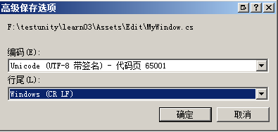

# warning
## 换行警告
```
There are inconsistent line endings in the 'Assets/script/MyComponent.cs' script. Some are Mac OS X (UNIX) and some are Windows.
This might lead to incorrect line numbers in stacktraces and compiler errors. Many text editors can fix this using Convert Line Endings menu commands.
```
* 原因  
使用unity默认的MonoDevelop IDE创建的脚本文件以“LF”结尾（Unix平台）  
如果使用vs打开脚本是以“CR LF”结尾（Windows平台）
* 解决方法  
在vs菜单中 **文件** --> **高级保存设置**  
把行尾设置为 **Windows （CR_LF）**   
