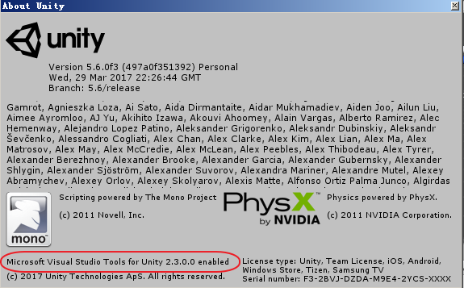
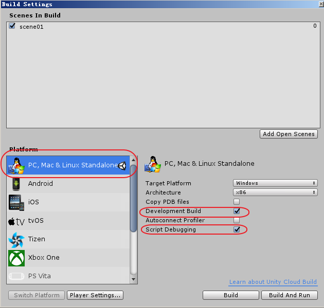
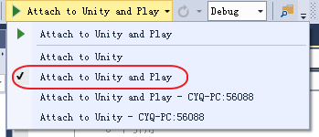

# VS调试Unity脚本
## 下载和安装
* 下载vs2013插件[vstu2013](http://pan.baidu.com/s/1dEPsaA1)
* 运行安装该插件
## Unity配置
* 重启Unity  
通过 Help --> About Unity 查看vs插件是否被安装上  

* 保证unity运行的平台是PC，同时开启调试模式  

## Unity项目配置
* 在项目的asset目录下，import package --> Visual studio 2013 Tools
* 调试代码  
在vs上使用  
