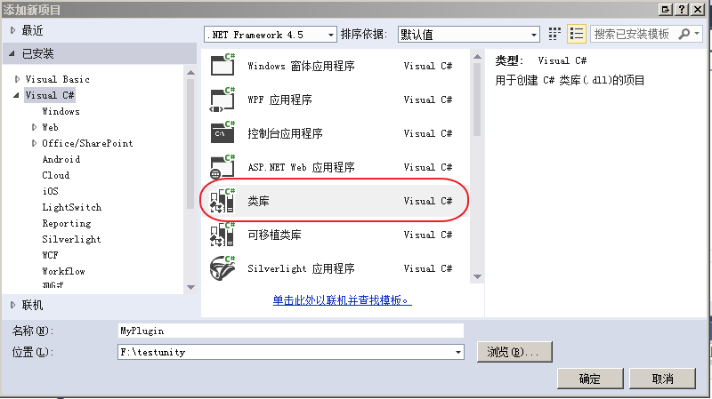
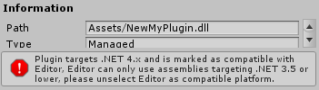

# 如何往编辑器导入C#的dll文件
* 这里的dll是c# 的动态链接库
* 目的使用C#的动态库

## 使用VS创建C#的dll文件
* 在unity解决方案中创建一个类库项目  

* 编写一段代码  
```c#
using System;

namespace NewMyPlugin
{
    public class Tool
    {
        public int add(int a, int b);
    }
}
```
* 编译生成dll文件

## 在unity中使用
* 把生成的dll拖放进asset文件夹内  
其实也可以在项目属性中把dll生成在asset的文件夹内  
在asset中的dll会被优先加载，详情见[脚本的加载次序](./脚本的加载次序.md)
* 在unity的C#中使用  
```c#
// 把名字空间包含进来
using NewMyPlugin;
// ...
// 使用
Tool.add(1,2);
```
## 注意事项
* 生成的C#的dll文件，框架需要使用 **.Net Framework 3.5或以下版本**，否则会报错  
  
当前使用的unity版本：5.6

