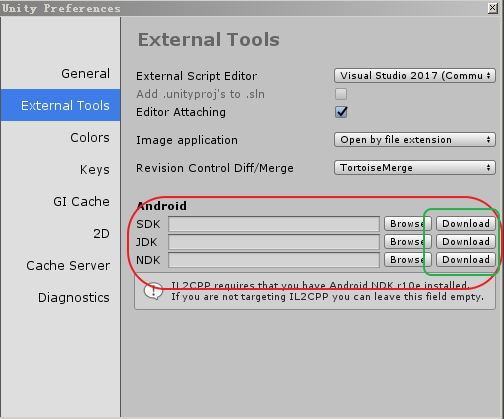
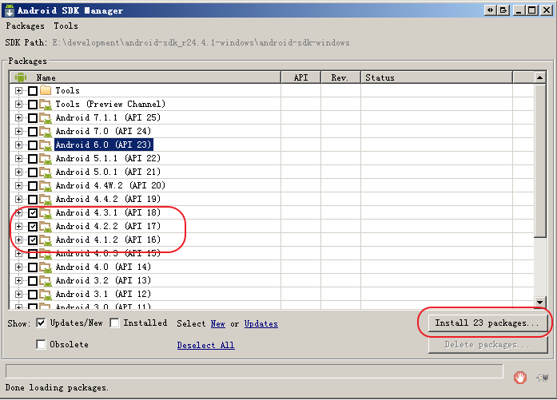
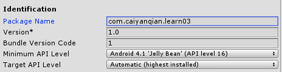

# 安卓包的配置
## 概况
* 在配置完成安卓环境后，通过unity3d 可以直接生产，apk 文件
## Build Setting 界面配置
* 界面  
  
* 点击 **Open Download Page**, 下载  
UnitySetup-Android-Support-for-Editor-5.6.0f3.exe 可执行程序，运行
* 运行，重启unity后  

* 界面的参数解释
    * Texture Compression  
    使用默认值 **Don't override** 即可  
    压缩的方式一般是在，创建资源的时候，进行设置的，使用这个参数会对所有的资源进行整体的设置
    * Build System  
    使用默认值 **Internal(Default)** 即可
    * Export Project
    * Development Build  
    相当于开启Debug版本，不勾选是Release版本
    * Autoconnect Profiler
    * Script Debugging 

## Android环境配置
* 打开preferences界面  
  Edit --> preferences  
  
* 配置 SDK
    * [下载地址](http://pan.baidu.com/s/1kVJqqCR)  
    * 打开 android sdk manager，下载相应版本的sdk  
    
    
* 配置 JDK
    * [下载地址](http://pan.baidu.com/s/1o80Tqjw)
* 配置 NDK
    * [下载地址](http://pan.baidu.com/s/1kVkKxs7)

# 设置包名
* 包名必须设置，否则编译不过去
* 包名格式：com.company.project 
* 在 Build Setting 中选择 Player Setting ... 到其对应的Inspector界面，修改 **Package Name** 即可

## 生成apk包
* 以上步骤配置完成，后
* 可在Build Setting 界面中，直接点击Build,选择生成apk的目录，即可自动生成