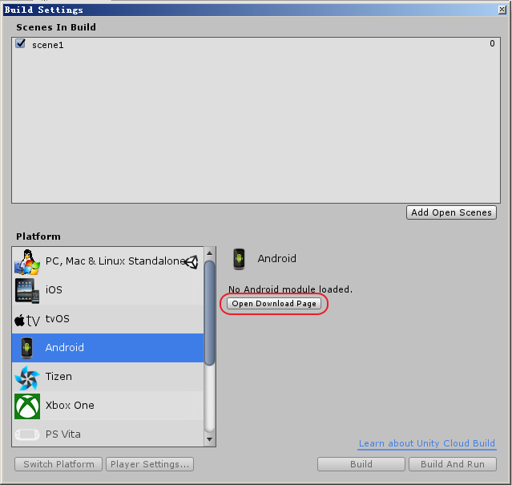
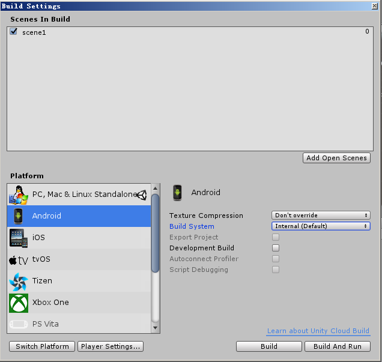

# 打开 Build Setting 界面

* 点击 **Open Download Page**, 下载 UnitySetup-Android-Support-for-Editor-5.6.0f3.exe 可执行程序，运行
* 运行，重启unity后

* 上面界面的参数解释
    * Texture Compression  

    |选项|说明|
    |:--:|:---|
    |Don't override|1|
    |DXT(Tegra)||
    |PVRTC(PowerVR)||
    |ATC(Adreno)||
    |ETC(default)||
    |ETC2(GLES 3.0)||
    |ASTC||

    * Build System

    |选项|说明|
    |:--:|:---|
    |Internal(Default)||
    |Gradle(New)||
    |ADT(Legacy)||
    * Export Project
    * Development Build
    * Autoconnect Profiler
    * Script Debugging 